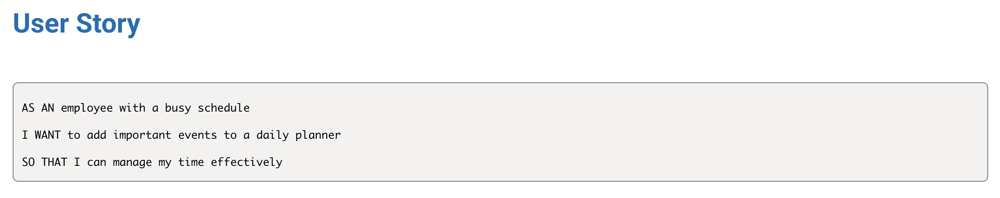
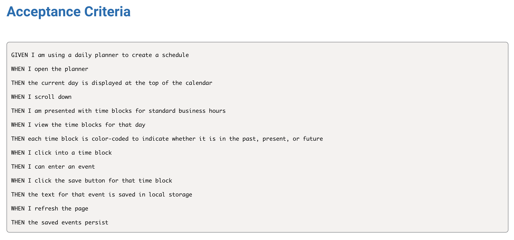
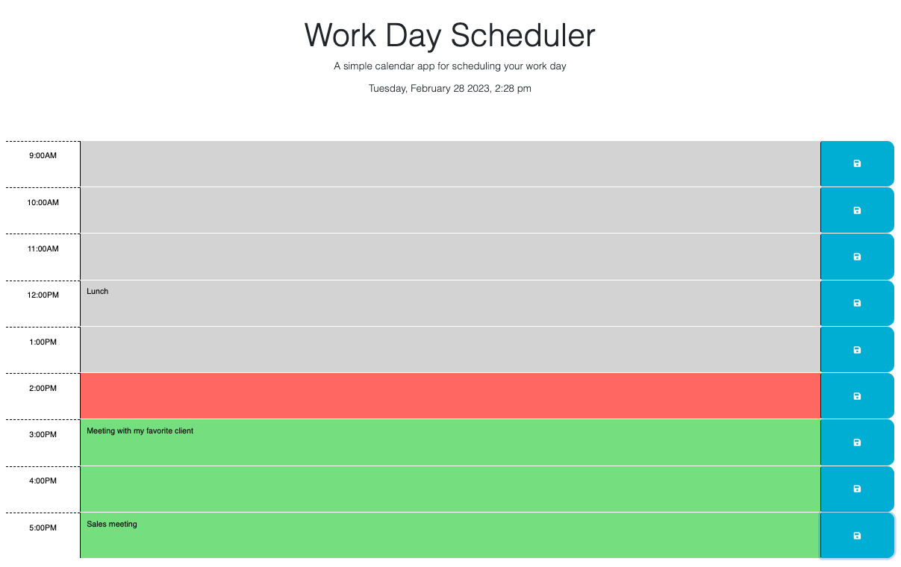

# Work Day Scheduler

## Deployed Site
https://elawilliam.github.io/work-day-scheduler/

## Description
This is a simple calendar application that allows users to save events for each hour of the day. This application is designed to run in the browser and features dynamically updated HTML and CSS powered by JQuery. It utilizes the Day.js library to work with date and time.

## Usage
Intended for users looking to save their daily events to an online calendar.

## Mock-Up

## License
Please see license information outlined in the repository.
